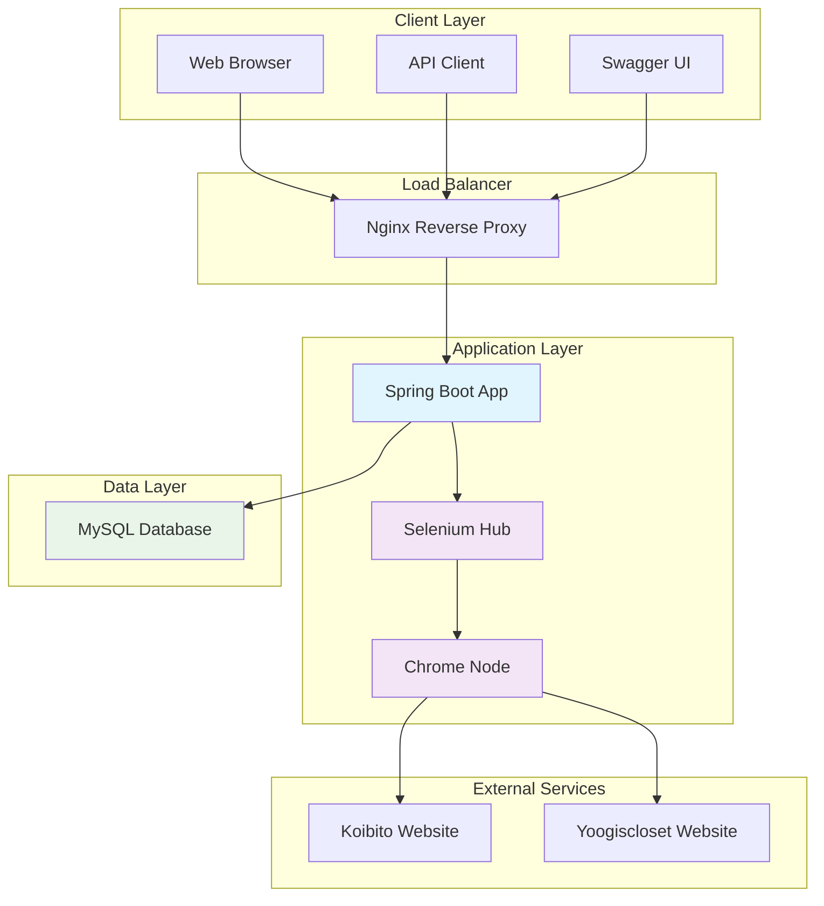
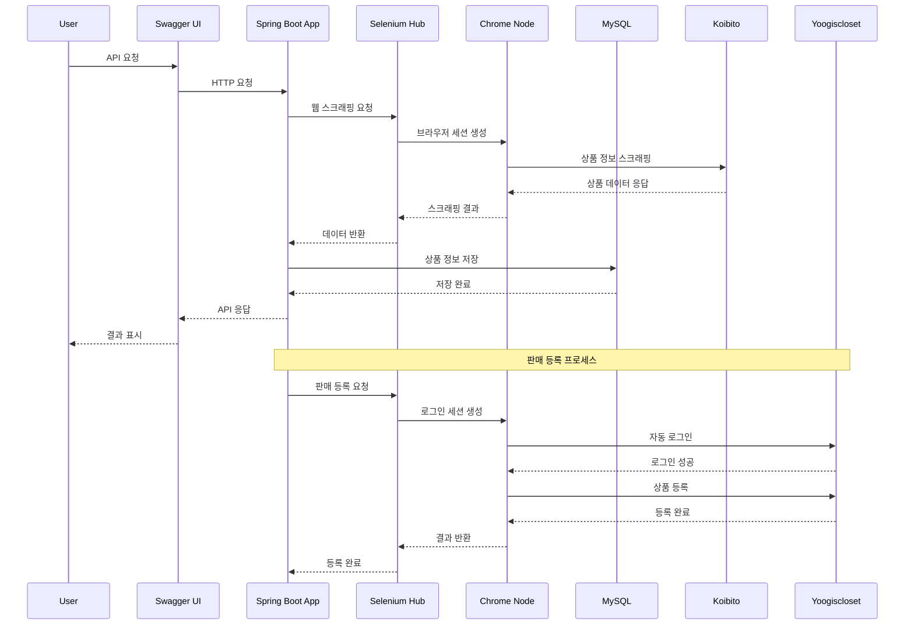
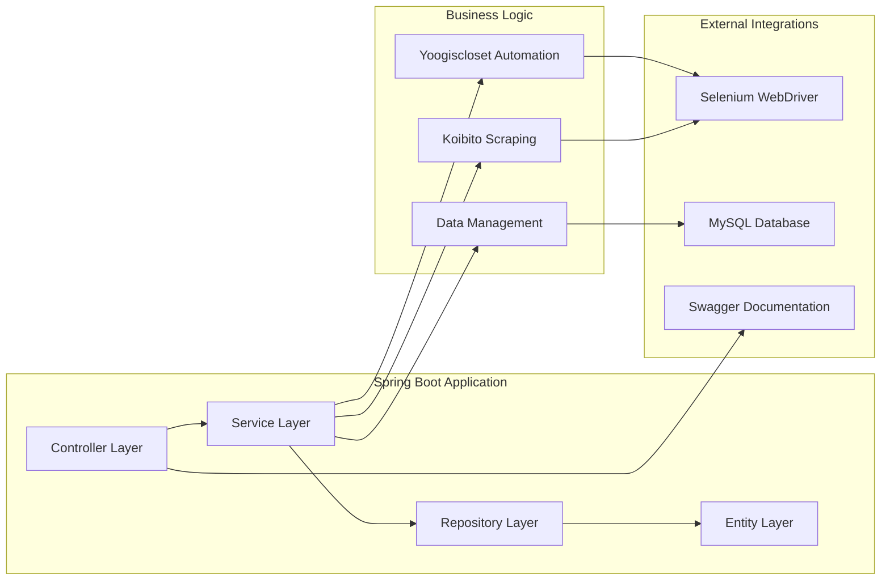

#  중고 의류 판매 플랫폼 통합 자동화 시스템

> **상품 스크래핑과 자동 판매 등록을 통합한 중고 의류 판매 자동화 시스템**

##  목차

- [프로젝트 개요](#프로젝트-개요)
- [시스템 아키텍처](#시스템-아키텍처)
- [주요 기능](#주요-기능)
- [기술 스택](#기술-스택)
- [프로젝트 구조](#프로젝트-구조)
- [API 명세서](#api-명세서)
- [Swagger 사용법](#swagger-사용법)
- [설치 및 실행](#설치-및-실행)
- [트러블 슈팅](#트러블-슈팅)
- [개발 과정에서의 느낀점](#개발-과정에서의-느낀점)
- [향후 개선 계획](#향후-개선-계획)
- [프로젝트 목적 및 주의사항](#-프로젝트-목적-및-주의사항)

##  프로젝트 개요

> **본 프로젝트는 크롤링 및 웹 자동화 기술 학습을 위한 개인 학습 프로젝트입니다.**

이 프로젝트는 쇼핑몰에서 상품 정보를 자동으로 스크래핑하고, 또 다른 쇼핑몰에에 자동으로 판매 등록하는 통합 자동화 시스템입니다. 

**학습 목적**: 웹 크롤링, Selenium 기반 브라우저 자동화, Spring Boot 마이크로서비스 아키텍처, Docker 컨테이너화 등 다양한 기술을 학습하고 실습하기 위해 개발되었습니다. 

### 핵심 가치
- **자동화**: 수동 작업을 최소화하여 효율성 극대화
- **안정성**: Docker 기반 컨테이너화로 일관된 실행 환경 보장
- **확장성**: 마이크로서비스 아키텍처로 기능별 독립적 확장 가능
- **모니터링**: 실시간 상태 확인 및 로그 추적
- **통합성**: 두 플랫폼 간의 원활한 데이터 연동

##  시스템 아키텍처

###  아키텍처 다이어그램



###  시스템 레이어 구조

| 레이어 | 구성 요소 | 역할 | 포트 | 기술 스택 |
|--------|-----------|------|------|-----------|
| **Client Layer** | Web Browser | 사용자 인터페이스 | 80, 443 | HTML, CSS, JavaScript |
| | API Client | 외부 시스템 연동 | 8081 | HTTP/REST |
| | Swagger UI | API 문서화 | 8081 | OpenAPI 3 |
| **Load Balancer** | Nginx | 리버스 프록시, 로드 밸런싱 | 80, 443 | Nginx |
| **Application Layer** | Spring Boot App | 비즈니스 로직, API 서버 | 8080 | Java 17, Spring Boot 3.2.5 |
| | Selenium Hub | 브라우저 자동화 관리 | 4444 | Selenium Grid 4.21.0 |
| | Chrome Node | 웹 스크래핑 실행 | - | Chrome WebDriver |
| **Data Layer** | MySQL | 데이터 저장소 | 3306 | MySQL 8.0 |
| **External Services** | Koibito Website | 상품 정보 소스 | - | 웹 스크래핑 대상 |
| | Yoogiscloset Website | 판매 등록 대상 | - | 웹 자동화 대상 |

###  데이터 플로우



###  컴포넌트 아키텍처



###  Docker 컨테이너 구조

| 컨테이너명 | 이미지 | 포트 | 역할 | 의존성 |
|------------|--------|------|------|--------|
| `yoogiscloset-app-prod` | `yooseokcho/yoogiscloset:latest` | 8081:8080 | 메인 애플리케이션 | MySQL, Selenium |
| `yoogiscloset-mysql-prod` | `mysql:8.0` | 3306 | 데이터베이스 | 없음 |
| `yoogiscloset-selenium-hub-prod` | `selenium/hub:4.21.0` | 4445:4444 | Selenium Hub | 없음 |
| `yoogiscloset-selenium-chrome-prod` | `selenium/node-chrome:4.21.0` | - | Chrome 브라우저 | Selenium Hub |
| `yoogiscloset-nginx` | `nginx:alpine` | 80:80, 443:443 | 리버스 프록시 | Spring Boot App |

###  아키텍처 특징

1. **마이크로서비스 패턴**: 각 기능별로 독립적인 서비스 구성
2. **컨테이너 오케스트레이션**: Docker Compose를 통한 서비스 관리
3. **리버스 프록시**: Nginx를 통한 로드 밸런싱 및 SSL 종료
4. **웹 스크래핑**: Selenium Grid를 통한 분산 브라우저 자동화
5. **데이터 영속성**: MySQL을 통한 상품 정보 저장
6. **API 문서화**: Swagger/OpenAPI 3를 통한 자동 문서 생성
7. **상태 관리**: 상품의 수집/처리/등록 상태 추적
8. **에러 처리**: 각 레이어별 예외 처리 및 복구 메커니즘

##  주요 기능

### 1.  상품 스크래핑
- **자동 상품 정보 수집**: URL을 통한 상품 데이터 자동 추출
- **데이터 정규화**: 일관된 형식으로 상품 정보 저장
- **중복 방지**: 동일 상품 중복 수집 방지 로직
- **이미지 수집**: 상품 이미지 URL 자동 수집 (최대 6개)

### 2.  자동 판매 등록
- **자동 로그인**: Selenium을 통한 자동 로그인 처리
- **세션 관리**: 로그인 쿠키 추출 및 관리
- **상품 등록**: 스크래핑된 데이터를 통한 자동 판매 등록
- **다중 이미지 업로드**: 최대 5개 이미지 자동 업로드

### 3. 통합 관리 시스템
- **RESTful API**: Swagger 기반 API 문서화
- **실시간 모니터링**: Health Check 및 상태 확인
- **로그 관리**: 구조화된 로깅 시스템
- **데이터 연동**: 두 플랫폼 간의 원활한 데이터 연동

##  기술 스택

### Backend
- **Java 17**: 최신 LTS 버전 사용
- **Spring Boot 3.2.5**: 마이크로서비스 프레임워크
- **Spring Data JPA**: 데이터 액세스 계층
- **Gradle**: 빌드 도구

### Database
- **MySQL 8.0**: 관계형 데이터베이스
- **Hibernate**: ORM 프레임워크

### Web Scraping
- **Selenium 4.21.0**: 웹 자동화 도구
- **Chrome WebDriver**: 브라우저 자동화
- **Selenium Grid**: 분산 브라우저 관리

### Infrastructure
- **Docker**: 컨테이너화
- **Docker Compose**: 멀티 컨테이너 오케스트레이션
- **Nginx**: 리버스 프록시 및 로드 밸런서

### Documentation & Monitoring
- **Swagger/OpenAPI 3**: API 문서화
- **Spring Actuator**: 애플리케이션 모니터링
- **Lombok**: 보일러플레이트 코드 제거

##  프로젝트 구조

```
yoogiscloset/
├── src/
│   ├── main/
│   │   ├── java/com/example/yoogiscloset/
│   │   │   ├── config/                 # 설정 클래스
│   │   │   │   ├── DatabaseConfig.java
│   │   │   │   ├── SeleniumConfig.java
│   │   │   │   └── SwaggerConfig.java
│   │   │   ├── controller/             # REST API 컨트롤러
│   │   │   │   ├── YoogisclosetController.java
│   │   │   │   ├── YoogisclosetSellController.java
│   │   │   │   └── YoogisclosetSellIntegrationController.java
│   │   │   ├── koibito/               # 고이비토 관련 모듈
│   │   │   │   ├── controller/
│   │   │   │   │   └── KoibitoController.java
│   │   │   │   ├── dto/
│   │   │   │   │   └── KoibitoProductDto.java
│   │   │   │   ├── entity/
│   │   │   │   │   └── KoibitoProduct.java
│   │   │   │   ├── repository/
│   │   │   │   │   └── KoibitoProductRepository.java
│   │   │   │   └── service/
│   │   │   │       ├── KoibitoDataService.java
│   │   │   │       └── KoibitoScrapingService.java
│   │   │   ├── service/               # 비즈니스 로직
│   │   │   │   ├── YoogisclosetService.java
│   │   │   │   └── YoogisclosetSellService.java
│   │   │   └── YoogisclosetApplication.java
│   │   └── resources/
│   │       ├── application.properties
│   │       ├── application-docker.properties
│   │       ├── application-prod.properties
│   │       └── sql/
│   │           └── init_database.sql
│   └── test/
├── nginx/
│   ├── nginx.conf
│   └── ssl/
├── docker-compose.yml
├── docker-compose-deploy.yml
├── Dockerfile
├── build.gradle
└── README.md
```

### 모듈별 역할

#### 1. Config 모듈
- **DatabaseConfig**: 데이터베이스 연결 설정
- **SeleniumConfig**: Selenium WebDriver 설정 (로컬/원격)
- **SwaggerConfig**: API 문서화 설정

#### 2. Controller 모듈
- **YoogisclosetController**: 유기스클로젯 인증 관리
- **KoibitoController**: 고이비토 상품 스크래핑 API
- **YoogisclosetSellIntegrationController**: 통합 판매 등록 API

#### 3. Service 모듈
- **KoibitoScrapingService**: 고이비토 웹 스크래핑 로직
- **KoibitoDataService**: 상품 데이터 관리
- **YoogisclosetService**: 유기스클로젯 자동화 로직
- **YoogisclosetSellService**: 판매 등록 자동화 로직

#### 4. Entity/DTO 모듈
- **KoibitoProduct**: 상품 엔티티 (상태 관리 포함)
- **KoibitoProductDto**: 상품 데이터 전송 객체

##  API 명세서

###  Koibito API (고이비토 상품 스크래핑)

#### 1. 상품 스크래핑
```http
POST /api/yg/koibito/scrape
Content-Type: application/x-www-form-urlencoded

url=https://m.koibito.co.kr/goods_view.html?no=581471
```

**응답 예시:**
```json
{
  "success": true,
  "message": "상품 정보가 성공적으로 수집되었습니다",
  "productId": 1,
  "productName": "CHANEL 클래식 캐비어 미듐",
  "brand": "CHANEL",
  "price": 12500000
}
```

#### 2. 상품 목록 조회
```http
GET /api/yg/koibito/products
```

**응답 예시:**
```json
[
  {
    "id": 1,
    "koibitoId": "529756",
    "productName": "CHANEL 클래식 캐비어 미듐",
    "productPrice": 12500000,
    "brand": "CHANEL",
    "status": "COLLECTED",
    "createdAt": "2025-10-28T05:32:33"
  }
]
```

#### 3. 특정 상품 조회
```http
GET /api/yg/koibito/products/{id}
```

###  Yoogiscloset Auth API (유기스클로젯 인증)

#### 1. 세션 생성
```http
POST /auth/yoogiscloset/session
```

**응답 예시:**
```json
[
  {
    "name": "session_id",
    "value": "abc123...",
    "domain": ".yoogiscloset.com",
    "path": "/",
    "secure": true
  }
]
```

###  Yoogiscloset Sell Integration API (통합 판매 등록)

#### 1. 고이비토 상품 ID로 판매 등록
```http
POST /api/yoogiscloset/sell/integration/submit/{koibitoProductId}
```

**응답 예시:**
```json
{
  "success": true,
  "message": "판매 정보가 성공적으로 등록되었습니다",
  "koibitoProductId": 1,
  "koibitoProductName": "CHANEL 클래식 캐비어 미듐",
  "uploadedImageCount": 5,
  "timestamp": "2025-10-28T05:32:33"
}
```

###  Health Check API

#### 1. 서비스 상태 확인
```http
GET /actuator/health
```

##  Swagger 사용법

### 1. 접속 방법
```
http://localhost:8081/swagger-ui.html
```

### 2. API 테스트 방법

#### Step 1: 고이비토 상품 스크래핑
1. **Koibito API** 섹션에서 `POST /api/yg/koibito/scrape` 클릭
2. **Try it out** 버튼 클릭
3. **url** 필드에 테스트 URL 입력:
   ```
   https://m.koibito.co.kr/goods_view.html?no=581471
   ```
4. **Execute** 버튼 클릭하여 실행

#### Step 2: 상품 목록 확인
1. **GET /api/yg/koibito/products** 클릭
2. **Try it out** → **Execute** 클릭
3. 스크래핑된 상품 목록 확인

#### Step 3: 유기스클로젯 세션 생성
1. **Yoogiscloset Auth API** 섹션에서 `POST /auth/yoogiscloset/session` 클릭
2. **Try it out** → **Execute** 클릭
3. 로그인 세션 쿠키 확인

#### Step 4: 통합 판매 등록
1. **Yoogiscloset Sell Integration API** 섹션에서 `POST /api/yoogiscloset/sell/integration/submit/{koibitoProductId}` 클릭
2. **Try it out** 클릭
3. **koibitoProductId** 필드에 숫자 입력 (예: 1)
4. **Execute** 클릭하여 판매 등록 실행

### 3. Swagger UI 기능

- **API 그룹화**: 기능별로 API가 그룹화되어 있음
- **실시간 테스트**: 서버 재시작 없이 API 테스트 가능
- **응답 확인**: HTTP 상태 코드와 JSON 응답 데이터 확인
- **파라미터 검증**: 필수 파라미터 및 데이터 타입 검증
- **예시 데이터**: 요청/응답 예시 제공

##  설치 및 실행

### 사전 요구사항
- Docker & Docker Compose
- Java 17+ (로컬 개발 시)
- MySQL 8.0+ (로컬 개발 시)

### 1. 로컬 개발 환경

```bash
# 저장소 클론
git clone <repository-url>
cd yoogiscloset

# 애플리케이션 실행
./gradlew bootRun

# 또는 Docker Compose로 실행
docker-compose up -d
```

### 2. 데이터베이스 설정

프로젝트는 통합된 SQL 초기화 스크립트를 사용합니다:

```sql
-- src/main/resources/sql/init_database.sql
-- 데이터베이스 생성, 테이블 스키마 정의, 인덱스 설정을 포함한 통합 스크립트
```

**주요 특징**:
- 데이터베이스 생성 (`ygkoibito`)
- 테이블 스키마 정의 (`koibito_products`)
- 인덱스 최적화
- 상세한 주석과 문서화
- 자동 실행 (Spring Boot 시작 시)

### 3. 프로덕션 환경

```bash
# Docker Compose Deploy 실행
docker-compose -f docker-compose-deploy.yml up -d

# 서비스 상태 확인
docker-compose -f docker-compose-deploy.yml ps

# 로그 확인
docker-compose -f docker-compose-deploy.yml logs app
```

### 4. Docker Hub 이미지 사용

```bash
# 최신 이미지 다운로드
docker pull yooseokcho/yoogiscloset:latest

# 특정 버전 사용
docker pull yooseokcho/yoogiscloset:2025.10.28
```

##  트러블 슈팅

### 1. 데이터베이스 연결 오류

**문제**: `Schema-validation: missing table [ygkoibito.koibito_products]`

**원인**: Hibernate가 `validate` 모드로 설정되어 테이블이 존재하지 않을 때 오류 발생

**해결책**:
```yaml
# docker-compose-deploy.yml
SPRING_JPA_HIBERNATE_DDL_AUTO: update  # validate → update로 변경
```

**개선사항**: 통합 SQL 스크립트 (`init_database.sql`)로 자동 초기화

### 2. SQL 파일 통합 개선

**기존 문제**: 
- `create_database.sql`: 수동 실행용 데이터베이스 생성 스크립트
- `data.sql`: 애플리케이션 시작 시 데이터 삭제 스크립트
- 두 파일이 분리되어 관리 복잡성 증가

**개선사항**:
- `init_database.sql`: 통합된 데이터베이스 초기화 스크립트
- 자동 실행 (Spring Boot 시작 시)
- 상세한 주석과 문서화
- 인덱스 최적화 포함
- 모든 환경에서 동일한 스크립트 사용

**새로운 SQL 파일 구조**:
```sql
-- src/main/resources/sql/init_database.sql
-- 1. 데이터베이스 생성 (ygkoibito)
-- 2. 테이블 스키마 정의 (koibito_products)
-- 3. 인덱스 최적화
-- 4. 테이블 정보 확인
-- 5. 샘플 데이터 조회
```

**설정 파일 업데이트**:
```properties
# 모든 application.properties 파일에 추가
spring.sql.init.mode=always
spring.sql.init.schema-locations=classpath:sql/init_database.sql
```

**장점**:
- 단일 파일로 모든 데이터베이스 초기화 관리
- 자동 실행으로 수동 작업 불필요
- 상세한 주석으로 유지보수성 향상
- 모든 환경에서 일관된 데이터베이스 구조
- 인덱스 최적화로 성능 향상

### 3. Selenium WebDriver 오류

**문제**: `chromedriver located at C:\Users\...\chromedriver.exe, but invalid`

**원인**: Docker 환경에서 로컬 ChromeDriver 경로를 찾으려고 시도

**해결책**:
```properties
# application-prod.properties
selenium.use.remote=true
selenium.hub.url=http://selenium:4444/wd/hub
```

### 4. Docker 이미지 빌드 실패

**문제**: Gradle 빌드 중 의존성 다운로드 실패

**해결책**:
```dockerfile
# Dockerfile - 멀티스테이지 빌드로 최적화
FROM eclipse-temurin:17-jdk AS builder
# 의존성 캐싱을 위한 레이어 분리
COPY build.gradle .
RUN ./gradlew dependencies --console=plain
```

### 5. 컨테이너 간 네트워크 통신 오류

**문제**: 애플리케이션에서 MySQL/Selenium에 접근 불가

**해결책**:
```yaml
# docker-compose-deploy.yml
networks:
  yoogiscloset-prod-network:
    driver: bridge

# 서비스별 네트워크 설정
services:
  app:
    networks:
      - yoogiscloset-prod-network
    depends_on:
      mysql:
        condition: service_healthy
```

### 6. 메모리 부족 오류

**문제**: Java 힙 메모리 부족으로 인한 OutOfMemoryError

**해결책**:
```yaml
# docker-compose-deploy.yml
environment:
  JAVA_OPTS: -Xmx512m -Xms256m
```

### 7. Selenium 세션 타임아웃

**문제**: 웹 스크래핑 중 세션 타임아웃 발생

**해결책**:
```yaml
# docker-compose-deploy.yml
selenium-chrome:
  environment:
    - SE_NODE_SESSION_TIMEOUT=300  # 5분으로 증가
```

##  개발 과정에서의 느낀점

### 1. 기술적 도전과 해결

#### 웹 스크래핑의 복잡성
- **도전**: 동적 웹 페이지의 복잡한 DOM 구조와 JavaScript 렌더링
- **해결**: Selenium WebDriver와 명시적 대기(Explicit Wait) 활용
- **학습**: 웹 자동화에서 안정성과 성능의 균형점 찾기
- **인사이트**: 봇 탐지 우회를 위한 인간적인 행동 패턴 모방의 중요성

#### Docker 컨테이너화의 이점
- **일관성**: 개발/테스트/프로덕션 환경의 완전한 일치
- **확장성**: 마이크로서비스 아키텍처의 자연스러운 구현
- **배포**: Docker Hub를 통한 간편한 배포와 버전 관리
- **학습**: 멀티스테이지 빌드로 이미지 크기 최적화의 중요성

### 2. 아키텍처 설계의 고민

#### 모듈화의 중요성
- **분리**: 스크래핑 로직과 데이터 관리 로직의 명확한 분리
- **재사용성**: 공통 기능의 추상화와 인터페이스 설계
- **테스트**: 각 모듈의 독립적인 테스트 가능성
- **인사이트**: 도메인별 패키지 구조가 코드 이해도와 유지보수성에 미치는 영향

#### 설정 관리의 복잡성
- **환경별 설정**: 개발/도커/프로덕션 환경별 최적화된 설정
- **보안**: 민감한 정보의 환경 변수 처리
- **유연성**: 런타임 설정 변경의 용이성
- **학습**: Spring Profile을 활용한 환경별 설정 분리의 효과

### 3. 운영 관점에서의 고려사항

#### 모니터링과 로깅
- **가시성**: Spring Actuator를 통한 애플리케이션 상태 모니터링
- **디버깅**: 구조화된 로깅으로 문제 추적 용이성
- **성능**: Health Check를 통한 서비스 상태 확인
- **인사이트**: 로그 레벨 조정이 운영 환경에서의 성능에 미치는 영향

#### 안정성과 복원력
- **재시작 정책**: Docker의 자동 재시작 기능 활용
- **의존성 관리**: 서비스 간 의존성과 시작 순서 고려
- **에러 처리**: 예외 상황에 대한 적절한 처리와 로깅
- **학습**: Circuit Breaker 패턴의 필요성과 구현 방법

### 4. 개발 생산성 향상

#### 도구의 활용
- **Swagger**: API 문서 자동 생성으로 개발 효율성 증대
- **Lombok**: 보일러플레이트 코드 제거로 가독성 향상
- **Gradle**: 의존성 관리와 빌드 자동화
- **인사이트**: 적절한 도구 선택이 개발 속도와 코드 품질에 미치는 영향

#### 코드 품질
- **일관성**: 코딩 컨벤션과 패턴의 일관된 적용
- **가독성**: 명확한 네이밍과 주석을 통한 코드 이해도 향상
- **유지보수성**: 모듈화된 구조로 변경과 확장의 용이성
- **학습**: Clean Code 원칙의 실무 적용과 그 효과

### 5. 비즈니스 로직 구현의 어려움

#### 웹 스크래핑의 한계
- **동적 콘텐츠**: JavaScript로 렌더링되는 콘텐츠의 처리
- **사이트 변경**: 웹사이트 구조 변경에 따른 스크래핑 로직 수정
- **성능**: 대량 데이터 처리 시의 성능 최적화
- **인사이트**: 안정적인 스크래핑을 위한 다중 전략 수립의 필요성

#### 데이터 연동의 복잡성
- **데이터 변환**: 서로 다른 플랫폼 간의 데이터 형식 통일
- **에러 처리**: 네트워크 오류나 사이트 변경에 대한 대응
- **상태 관리**: 상품의 수집/처리/등록 상태 추적
- **학습**: 상태 머신 패턴을 활용한 복잡한 워크플로우 관리


---

##  유용한 명령어

```bash
# 프로젝트 빌드
./gradlew bootJar

# Docker 이미지 생성
docker build -t yooseokcho/yoogiscloset:latest .

# 모든 서비스 실행
docker-compose -f docker-compose-deploy.yml up -d

# 컨테이너 상태 확인
docker-compose -f docker-compose-deploy.yml ps

# 애플리케이션 로그 확인
docker-compose -f docker-compose-deploy.yml logs app

# 실시간 로그 보기
docker-compose -f docker-compose-deploy.yml logs -f app

# 모든 서비스 종료 및 정리
docker-compose -f docker-compose-deploy.yml down

# Swagger UI 접속
http://localhost:8081/swagger-ui.html
```

---

##  프로젝트 목적 및 주의사항

**본 프로젝트는 크롤링 및 웹 자동화 기술 학습을 위한 개인 학습 프로젝트입니다.**


---

### 시연 스크린샷

0. 스웨거 api


1. 자동로그인 기능 (스웨거)


1. 자동로그인 기능 (콘솔 스크린샷)


2. 상품 스크래핑 스웨거 스크린샷


2. 상품 스크래핑 콘솔


3. 상품 스크래핑 mysql 스크린샷


4. 모든 상품 조회 스크린샷


5. 특정 제품 아이디로 상품조회 스크린샷


6. 셀레니움을 활용한 상품정보 자동입력(콘솔)


6. 셀레니움을 활용한 상품정보 자동입력(스웨거)_


